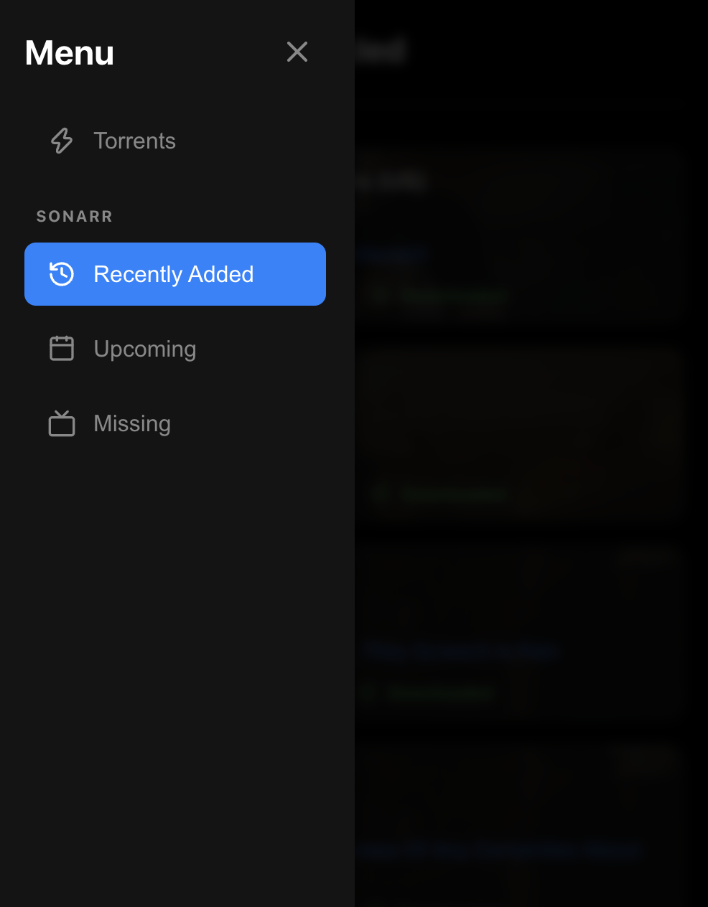

# qBitWeb

A beautiful, modern, and lightweight custom Web UI for qBittorrent, built with React and Vite.

qBitWeb replaces the default qBittorrent web interface with a sleek, responsive, and high-performance React application. It features a modern row-based layout, premium dark mode aesthetics with glassmorphism, seamless Sonarr integration, and advanced torrent file management.

## Screenshots

<details>
  <summary><strong>View Screenshots</strong></summary>

  ### Torrent List
  

  ### Burger Menu
  

  ### Recently Added (Sonarr)
  

  ### Upcoming (Sonarr)
  

  ### Missing (Sonarr)
  

  ### Add Torrent Popup
  

  ### Torrent File Manager & Search
  

</details>

## Features

- **Modern Aesthetics**: A beautifully crafted dark mode UI inspired by modern web apps.
- **Sonarr Integration**: Connect directly to your Sonarr instance to view Upcoming episodes, Missing episodes, and Recently Added history natively within the UI!
- **Advanced File Manager**: Open any torrent to view a hierarchical folder tree of its contents. Search, filter, and selectively toggle files or entire directories to download exactly what you want.
- **Flexible Adding**: Add torrents via Magnet URLs or upload multiple `.torrent` files at once. Optionally assign qBittorrent categories on upload.
- **Global Actions**: Easily stop or start all torrents at once.
- **Responsive Layout**: Works flawlessly on both desktop and mobile devices.
- **Optimistic UI**: Buttons provide instant visual feedback (loading spinners and state changes) for a snappy experience.

## Getting Started

You have a few ways to run qBitWeb depending on your setup. 

### Method 1: As an "Alternative Web UI" (Recommended for simplicity)

This is the fastest method to install it directly into your existing qBittorrent application.

1. Ensure you have Node.js installed.
2. Clone this repository and navigate into it:
   ```bash
   git clone https://github.com/yourusername/qBitWeb.git
   cd qBitWeb
   ```
3. Install dependencies and build the static files:
   ```bash
   npm install
   npm run build
   ```
4. Open your current qBittorrent Web UI and navigate to **Settings -> Web UI**.
5. Check the box for **"Use alternative Web UI"**.
6. Set the path to the absolute path of the `dist` folder that was just created (e.g., `/home/user/qBitWeb/dist`).
7. Refresh your browser!

### Method 2: Standalone Docker Container

Perfect for advanced setups or reverse proxies where you want the UI running in its own isolated container.

1. Create a `.env` file in the root of the project to tell Docker where your qBittorrent API is located:
   ```env
   QBITTORRENT_URL=http://192.168.1.100:8080
   ```
2. Build and run the Docker container:
   ```bash
   docker build -t qbitweb .
   docker run -d --name qbitweb --restart unless-stopped -p 3000:80 --env-file .env qbitweb
   ```
3. Access the UI at `http://localhost:3000`.

**Updating your Docker container:**
When you pull new code (or make changes), you need to stop and remove the old container before running the new one:
```bash
docker build -t qbitweb .
docker stop qbitweb
docker rm qbitweb
docker run -d --name qbitweb --restart unless-stopped -p 3000:80 --env-file .env qbitweb
```

### Method 3: Local Development

If you want to modify the code or run it locally for testing:

1. Install dependencies:
   ```bash
   npm install
   ```
2. Create a `.env` file with your qBittorrent URL:
   ```env
   VITE_QBIT_URL=http://192.168.1.100:8080
   ```
3. Start the Vite development server:
   ```bash
   npm run dev
   ```
4. Open `http://localhost:5173` in your browser.

## Optional Sonarr Integration

qBitWeb can seamlessly connect to your Sonarr instance to display upcoming episodes, missing episodes, and your recent download history directly in the sidebar menu.

To enable this feature, simply add your Sonarr URL and API Key to your `.env` file (if using Docker or Local Development):

```env
# Sonarr configuration
SONARR_URL=http://192.168.1.101:8989
SONARR_API_KEY=your_sonarr_api_key_here
```

*(Note: For Local Development with Vite, you can optionally prefix these with `VITE_` if needed, but the dev server is configured to automatically pick up `SONARR_URL` and `SONARR_API_KEY` for its proxy as well).*

## Tech Stack

- **React** (UI Framework)
- **Vite** (Build Tool)
- **Lucide React** (Icons)
- **Date-fns** (Date formatting)
- **Vanilla CSS** (Styling)

## License
MIT License
