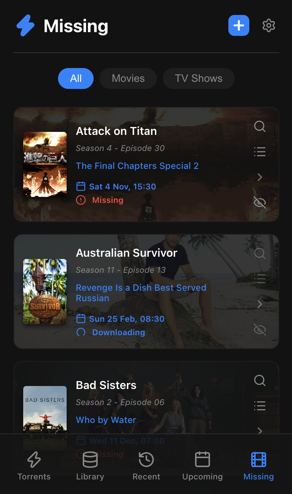
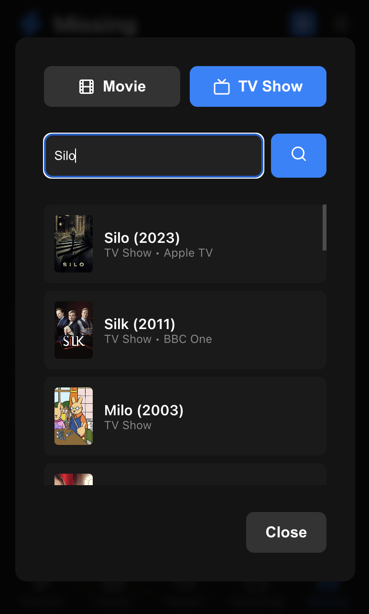
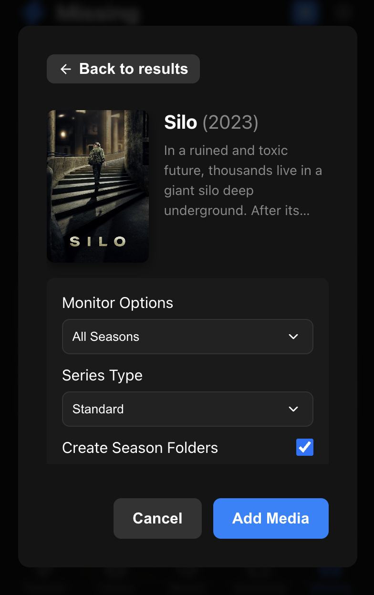
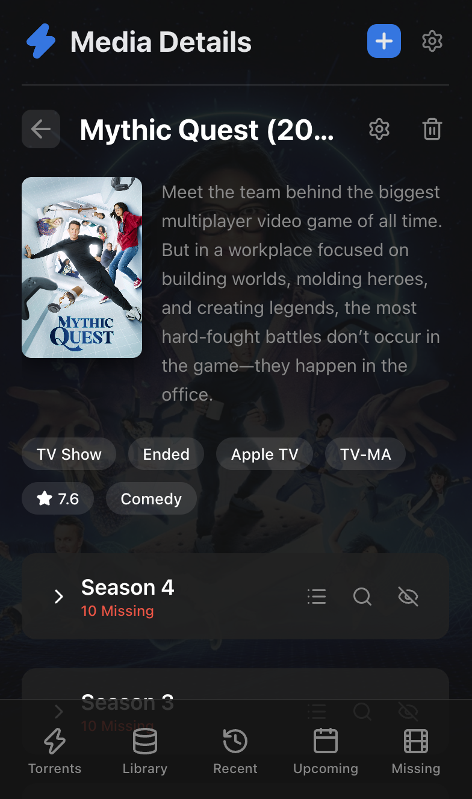

# qBitWeb

A unified Web UI for your media stack, built with React and Vite.

qBitWeb serves as a frontend for **qBittorrent**, **Sonarr**, and **Radarr**. It features a row-based layout, dark mode UI, media integration, and advanced torrent file management.

**All services are optional.** Mix and match Radarr, Sonarr, and qBittorrent to create the exact dashboard you need, or use all three for a unified home media experience.

## Features

- **Modular Services**: Configure only what you need. If you only use qBittorrent, it acts as a full-screen torrent client. If you add Sonarr or Radarr, it transforms into a media dashboard.
- **Dark Mode UI**: Interactive elements, smooth transitions, and responsive design for mobile and desktop.
- **Media Integrations**: View Upcoming releases, Missing media, and Recently Added history natively within the UI from Sonarr and Radarr.
- **Interactive Search & Discovery**: Browse and search for new Movies or TV Shows right from the dashboard, configure root folders and quality profiles, and add them directly to your servers.
- **Detailed Media Views**: Click into any movie or show to view a backdrop, synopsis, download status, and trigger direct search and delete commands.
- **Torrent File Manager**: Open any torrent to view a hierarchical folder tree of its contents. Search, filter, and selectively toggle files or entire directories.
- **Global Toast Notifications**: Search results from Sonarr and Radarr natively display as clean toast notifications in the UI, letting you know instantly when downloads begin or if no results were found.
- **Active Searches Modal**: A global spinning indicator tracks any ongoing searches across the app. Tap it to view a modal of all currently active background searches.
- **Secure Authentication**: Built-in password protection and WebAuthn Passkey support.

## Screenshots

<details>
  <summary><strong>View Screenshots</strong></summary>

  ### Torrent List
  

  ### Missing Media with Filters
  

  ### Discover and Add Media
  

  ### Add Media Setup
  

  ### Media Details & Actions
  

  ### Recently Added
  

  ### Upcoming Releases
  

  ### Bottom Navigation
  

  ### Add Torrent Popup
  

  ### Torrent File Manager & Search
  

</details>

## Getting Started

You have a few ways to run qBitWeb depending on your setup. 

### Method 1: Standalone Docker Container (Recommended)

Perfect for advanced setups or reverse proxies where you want the UI running in its own isolated container. The Docker image is automatically built and published to the GitHub Container Registry (`ghcr.io`).

Run the container and pass in your URLs. **All of these environment variables are completely optional.**

```bash
docker run -d \
  --name qbitweb \
  --restart unless-stopped \
  -p 3000:80 \
  -v /path/to/your/data:/app/data \
  -e QBITTORRENT_URL=http://192.168.1.100:8080 \
  -e QBITTORRENT_USERNAME=admin \
  -e QBITTORRENT_PASSWORD=adminadmin \
  -e SONARR_URL=http://192.168.1.101:8989 \
  -e SONARR_API_KEY=your_sonarr_api_key_here \
  -e RADARR_URL=http://192.168.1.102:7878 \
  -e RADARR_API_KEY=your_radarr_api_key_here \
  ghcr.io/havok89/qbitweb:latest
```
Access the UI at `http://localhost:3000`.

**Updating your Docker container:**
When a new release is out, simply pull the latest image and recreate your container:
```bash
docker pull ghcr.io/havok89/qbitweb:latest
docker stop qbitweb
docker rm qbitweb
# Run the docker run command again!
```

### Method 2: Node.js Backend

You can run the built-in Node server directly.

1. Ensure you have Node.js installed.
2. Clone this repository:
   ```bash
   git clone https://github.com/yourusername/qBitWeb.git
   cd qBitWeb
   ```
3. Install dependencies and build the frontend:
   ```bash
   npm install
   npm run build
   ```
4. Copy `.env.example` to `.env` and fill out your desired optional connections:
   ```bash
   cp .env.example .env
   ```
5. Start the server:
   ```bash
   npm start
   ```

### Method 3: Local Development

If you want to modify the code or run it locally for testing:

1. Install dependencies:
   ```bash
   npm install
   ```
2. Create a `.env` file with your optional server configurations (see `.env.example`).
3. Start the dev backend and the Vite frontend:
   ```bash
   npm run dev:server
   npm run dev
   ```
4. Open `http://localhost:5173` in your browser.

## Tech Stack

- **React** (UI Framework)
- **Vite** (Build Tool)
- **React Router** (Navigation)
- **Lucide React** (Icons)
- **Vanilla CSS** (Styling)

## License
MIT License
